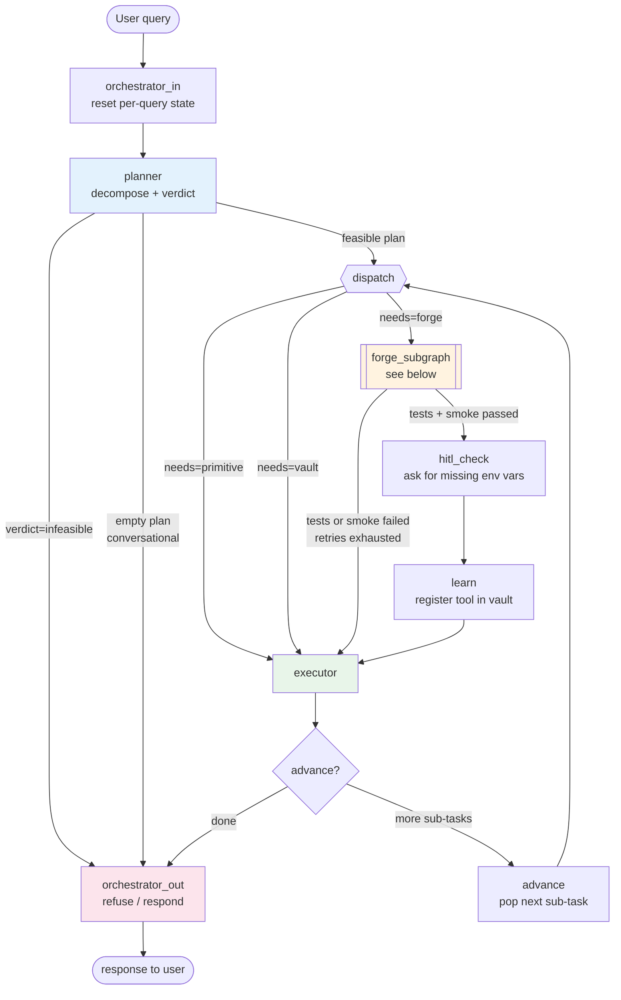
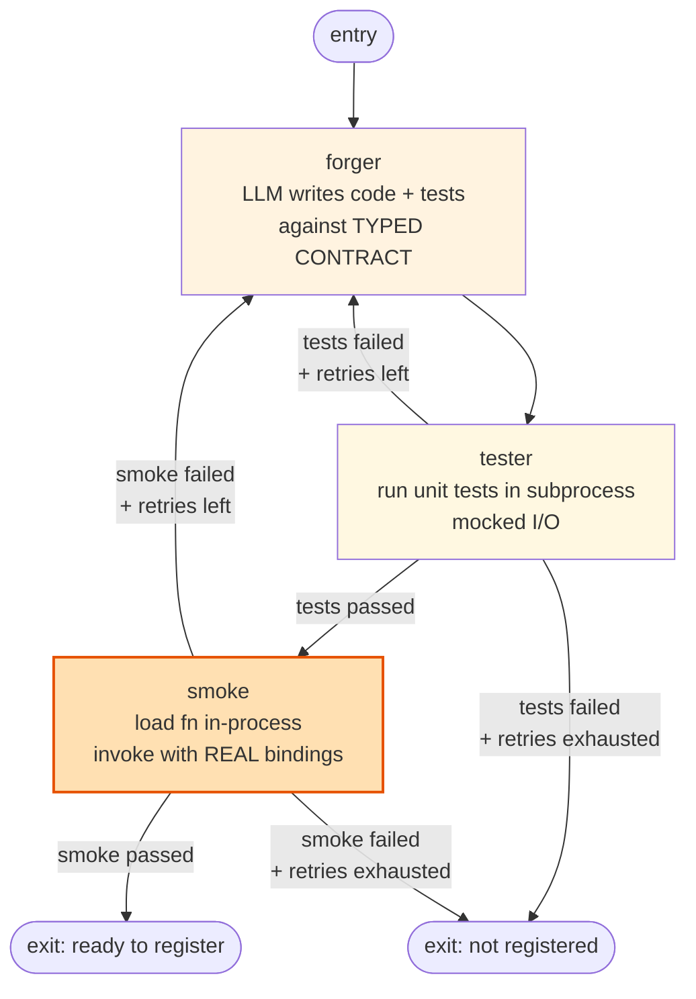

# Talos AI — Architecture

_Updated 2026-05-05 after Changes 1–3: typed contracts, smoke-test gate, refusal verdict._

## High level



## Forge sub-graph (zoomed)



## Data contracts between agents

```mermaid
flowchart LR
    PL[planner] -->|Plan{<br/>verdict,<br/>sub_tasks: [<br/> {id, action, needs,<br/>  input_schema,<br/>  output_schema,<br/>  param_bindings,<br/>  depends_on}<br/>]<br/>}| Bus

    Bus -->|sub_task.input_schema<br/>= function signature| FG[forger]
    Bus -->|sub_task.param_bindings<br/>= concrete kwargs| EX[executor]
    Bus -->|sub_task.param_bindings<br/>= smoke kwargs| SM[smoke]

    FG -->|forged_tool{<br/>name, code, test_code,<br/>needs_env_vars<br/>}| Bus2

    Bus2 -->|test_result| TS[tester]
    Bus2 -->|smoke_result| SM
    Bus2 -->|registered tool| LRN[learn]

    style Bus fill:#f3e5f5
    style Bus2 fill:#f3e5f5
```

The Planner's output is the single source of truth for forge sub-tasks. The function the Forger writes, the smoke kwargs the gate uses, and the kwargs the Executor passes at run time all derive from the *same* `input_schema` + `param_bindings` block. No more triangle of independent interpretations.

## What changed (vs. pre-Change 1-3)

| Concern | Before | After |
|---|---|---|
| Planner → Forger handoff | English prose | `input_schema` + `output_schema` + `param_bindings` |
| Executor arg resolution | LLM resolver per call | Direct from bindings (LLM only for primitive/vault) |
| Pre-call validation | None | `_validate_kwargs(fn, kwargs)` against `inspect.signature` |
| Tool registration gate | Unit tests passed | Unit tests passed AND smoke passed |
| Real-call validation | Inside Executor (after registration) | New `smoke` node before registration |
| Refusal of infeasible queries | Forge anyway → empty answer | Planner verdict → direct refuse path |
| State fields | `test_result`, `retry_count` | `+ smoke_result` |
| Forger retry context | Unit-test failure only | Unit-test OR smoke-failure (clearly tagged) |

## File map for the new architecture

| Concern | File |
|---|---|
| State schema | `talos/state.py` |
| Planner agent + Pydantic Plan/SubTask schema | `talos/agents/planner.py` |
| Planner system prompt (rules 1–13, including new typed-contract + verdict) | `talos/prompts/planner.py` |
| Forger agent (consumes contract block) | `talos/agents/forger.py` |
| Forger system prompt (rule 9b: contract is non-negotiable) | `talos/prompts/forger.py` |
| Tester (mocked unit tests in subprocess) | `talos/agents/tester.py` |
| **Smoke gate** (new) | `talos/agents/smoke.py` |
| Forge sub-graph (forge → test → smoke → register) | `talos/agents/forge_subgraph.py` |
| Executor (typed-contract path + LLM-resolver fallback) | `talos/agents/executor.py` |
| Orchestrator routers (verdict-aware planner router, smoke-aware register router) | `talos/agents/orchestrator.py` |
| Top-level graph wiring | `talos/graph.py` |

## Why these three together (not separately)

- **Typed contracts** (Change 2) give the smoke gate (Change 1) something concrete to validate against. Without them, smoke would have to LLM-resolve args, which is exactly the loop we're trying to break.
- **Smoke gate** (Change 1) gives the refusal path (Change 3) a clean failure signal: if a forge attempt blows up at smoke 3 times in a row, the system can escalate to "infeasible" rather than registering a broken tool and returning silence.
- **Refusal verdict** (Change 3) gives the Planner somewhere to send queries that don't fit the contract model in the first place. Predict the future? `physics-impossible`. Use a non-existent library? `missing-resource`. No forge attempted, no vault pollution.

## Boundaries (what's still unchanged)

- LangGraph as the substrate, single-orchestrator topology (no multi-agent spawn).
- Vault is still flat keyword-search (no semantic embeddings).
- Tester is still a mocked subprocess runner — not pytest, no fixtures.
- Researcher is still a utility called from inside Planner / Forger, not a graph node.
- Subprocess timeout is still the only sandboxing — no Docker / E2B.

These are deliberate POC choices, not gaps. They graduate when scale demands it.
